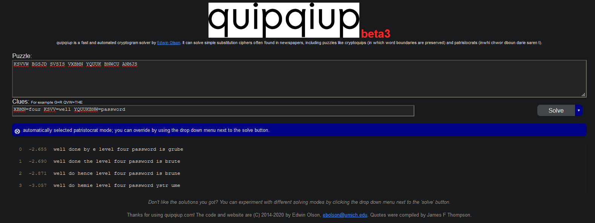

I used a thirt party tool to crack the caesar ciper here.  It was not a basic Rot13, or any sort of rotation.  It was an actual substitution cipher.

This password is in ALL UPPERCASE - just not all the rest!
password: BRUTE
