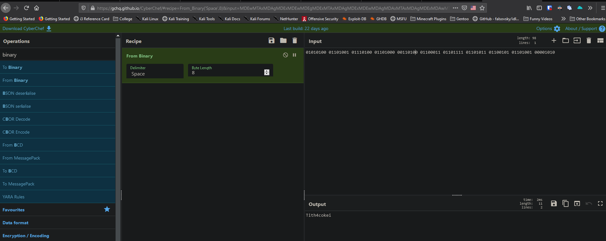

leviathan4@leviathan:~$ ls -alh
total 24K
drwxr-xr-x  3 root root       4.0K Aug 26  2019 .

drwxr-xr-x 10 root root       4.0K Aug 26  2019 ..

-rw-r--r--  1 root root        220 May 15  2017 .bash_logout

-rw-r--r--  1 root root       3.5K May 15  2017 .bashrc

-rw-r--r--  1 root root        675 May 15  2017 .profile

dr-xr-x---  2 root leviathan4 4.0K Aug 26  2019 .trash

leviathan4@leviathan:~$ ls -alh ./.trash/

total 16K

dr-xr-x--- 2 root       leviathan4 4.0K Aug 26  2019 .

drwxr-xr-x 3 root       root       4.0K Aug 26  2019 ..

-r-sr-x--- 1 leviathan5 leviathan4 7.2K Aug 26  2019 bin

leviathan4@leviathan:~$ ./.trash/bin
01010100 01101001 01110100 01101000 00110100 01100011 01101111 01101011 01100101 01101001 00001010

leviathan4@leviathan:~$

After logging in and looking at the home folders, I found a .trash which seemed out of place.  I ran the bin file inside of it and it spit out some binary.  I used cyberchef to convert this binary into ascii and we have leviathan5 password

